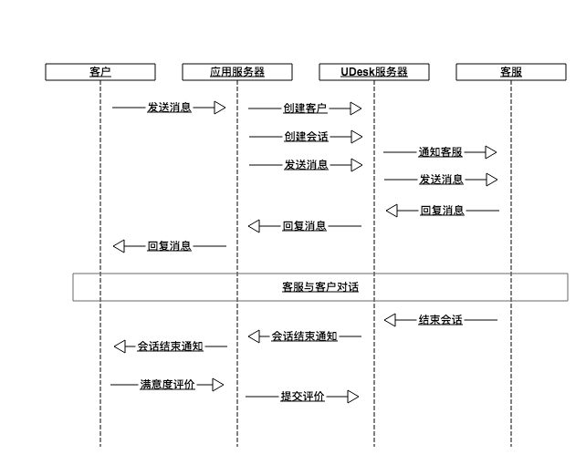

## 交互流程



## 创建客户

文档参考: [创建用户](http://www.udesk.cn/website/doc/apiv2/customers/#_10)

>  TODO: 添加新的  devices (韦昭)

## 创建会话(请求分配客服)

`POST /im/sessions`


### 请求参数

|     参数名     |  类型  | 必填 |                          说明                          |
|----------------|--------|------|--------------------------------------------------------|
| customer_token | 字符串 | 是   | 应用端客户唯一标识                                     |
| assign_type    | 字符串 | 否   | 期望的分配类型, 'robot', 'agent', 默认为 'robot'       |
| agent_id       | 整型   | 否   | 指定分配的客服id，如果指定忽略 assign_type 和 group_id |
| group_id       | 整型   | 否   | 指定分配的客服组id，如果指定忽略 assign_type           |
| channel        | 字符串 | 否   | 自定义渠道                                             |

> 如果 agent_id 和 group_id 都没有指定，且 assign_type 为 'agent'，则按系统分配规则分配


### 返回数据

|      属性名       |  类型  |                 说明                 |
|-------------------|--------|--------------------------------------|
| code              | 整型   | 执行结果码，1000代表成功             |
| message           | 字符串 | 分配成功时为欢迎语，失败时为错误提示 |
| assign_type       | 字符串 | 分配类型, 'robot', 'agent'           |
| assign_info       | 对象   | 分配结果信息                         |

根据 assign_type 不同 assign_info 的结构不同。

assign_type 为 robot 时, assign_info 的结构如下:

|     属性名      |  类型  |    说明    |
|-----------------|--------|------------|
| robot_name      | 字符串 | 机器人姓名 |
| robot_avatar    | 字符串 | 机器人头像 |
| welcome_message | 字符串 | 欢迎语     |
| unknow_message  | 字符串 | 未知回答语 |


assign_type 为 agent 时, assign_info 的结构如下:

|      属性名       |  类型  |                 说明                 |
|-------------------|--------|--------------------------------------|
| im_sub_session_id | 整型   | 会话ID                               |
| count             | 整型   | 排队位置                             |
| agent_id          | 整型   | 分配的客服id                         |
| agent_name        | 字符串 | 分配的客服名称                       |
| agent_avatar      | 字符串 | 客服头像地址                         |
| survey_options    | 哈稀   | 满意度评价设置                       |

survey_options 的元素格式如下:

```yaml
"survey_options":
    "enabled": true,   # 是否开房
    "name": "满意度评价",
    "title": "您对本服务的评价是?",  # 给客户显示提示
    "desc": "感谢您的支持，为了使我们更好的为您服务，请您为本次服务做一个评价（回复字母即可）",  #微信微博API满意度评价引导语
    "remark_enabled": true,  # 是否可填写评价备注
    "remark": "您可填写评价备注", # 评价备注提示
    "options": [    #  评价选项/ id对应 /im_sessions/survey 的 option_id
      {
        "id": 36,
        "text": "超级满意2",
        "enabled": true
      },
      {
        "id": 37,
        "text": "满意2",
        "enabled": true
      },
      {
        "id": 38,
        "text": "一般2",
        "enabled": true
      },
      {
        "id": 39,
        "text": "不满意",
        "enabled": true
      },
      {
        "id": 40,
        "text": "非常不满意",
        "enabled": true
      }
    ],
    "methods": [  # 满意度评价方式
      {
        "id": 7,
        "flag": "after_session",
        "text": "对话结束后弹出",
        "enabled": true
      },
      {
        "id": 74,
        "flag": "agent_invite",
        "text": "客服主动邀请",
        "enabled": true
      },
      {
        "id": 1485,
        "flag": "customer_invite",
        "text": "客户主动满意度评价（仅支持web和Android/iOS SDK）",
        "enabled": true
      }
    ]
```


********************************


## 发送消息

`POST /im/messages`


### 请求参数

|      参数名       |  类型  | 必填 |                               说明                              |
|-------------------|--------|------|-----------------------------------------------------------------|
| customer_token    | 字符串 | 是   | 应用端客户唯一标识                                              |
| im_sub_session_id | 整型   | 是   | 会话ID                                                          |
| type              | 字符串 | 否   | 消息类型, 'message', 'image', 'audio', 'rich', 默认为 'message' |
| data              | 对象   | 是   | 消息内容                                                        |

根据 type 类型，data 的结构也有所不同:

type 为 'message' 时(文本类型)：

```yaml
type: 'message'
data:
    font: 字体格式, 选填, 比如
    content: 文本内容  注: 文本内容可以包含 富文本 html 标签

type: 'image'
data:
    content: url

type: 'video'
data:
    content: url
    filename: '足球.mp4' #
    filesize: "4.3M"
    duration: 200       # 语音时长,可能没有 # 单位为s

type: 'audio'  # 仅支持mp4
data:
    content: url
    filename: '足球.mp4' # 文件名称
    filesize: "4.3M"    # 文件大小

TODO: 补全如下类型
rich
struct
start_session
transfer
close
survey
is_info_transfer
active_guest
info_appoint
form
form
info
robot_transfer
```

type 的取值范围:

消息

- message 文本消息
- image 图片消息
- audio 语言消息
- video 视频消息
- file 文件消息
- rich 富文本消息
- struct 结构话消息

事件

- start_session: 对话开始
- transfer: 转接事件
- close：会话关闭事件 atuo: true
- survey：满意度评价相关事件 atuo: true
- is_info_transfer：转接事件，属于属性区别，类型（type）为message
- active_guest：客服主动会话事件
- info_appoint: 客服分配客户事件
- form: 发送表单消息事件
- form_received: 接受表单消息事件 is_receive:
- info: 询前表单 is_receive: false
- robot_transfer:　机器人转接对话


### 返回数据

| 属性名 | 类型 |           说明           |
|--------|------|--------------------------|
| code   | 整型 | 执行结果码，1000代表成功 |


********************************


## 回复消息通知

### 请求方法

`POST {接收消息URL}`

> 接收消息URL，请联系我们的技术支持为您设置，后期会提供设置界面


### 请求参数

|     参数名     |  类型  | 必填 |            说明            |
|----------------|--------|------|----------------------------|
| customer_token | 字符串 | 是   | 应用端客户唯一标识         |
| assign_type    | 字符串 | 是   | 分配类型, 'robot', 'agent' |
| message        | 对象   | 是   | 消息                       |

根据 assign_type 不同，message 的格式有所不同

当 assign_type 为 'robot' 时, message 的格式如下

```yaml
message:
  type: 消息类型
  message_id: 消息id
  data: 消息内容
    question_id: 0为寒暄库，非问答; 非0时，可对问答进行有用无用评价
    question_title: 问题文字
    answer: 问题答案文字
    gus_list: 问题引导列表
    relate_list: 相关问题列表
    third_url: 相关推荐链接
```

当 assign_type 为 'agent' 时, message 的格式如下

```yaml
message:
  type: 消息类型, 'message', 'image', 'audio', 'rich', 参见 http://git.flyudesk.com/udesk/udesk_im/blob/master/doc/server/agent_logs.md
  message_id: 消息id
  agent_id: 客服id
  agent_name: 客服名称
  agent_avatar: 客服头像
  im_sub_session_id: 会话ID
  data: 与发送消息内容相同
    font: 字体, 仅支持message
    content: 内容
```


### 返回数据

请在10秒内返回 HTTP Status Code 200，响应体为空，否则 UDesk 端会认为发送失败，并尝试重发


********************************


## 机器人问答评价

### 参数

|     参数名     |  类型  | 必填 |           说明           |
|----------------|--------|------|--------------------------|
| customer_token | 字符串 | 是   | 应用端客户唯一标识       |
| message_id     | 字符串 | 是   | 所评价机器人答案的消息ID |
| question_id    | 整型   | 是   | 问题ID                   |
| useful         | 布尔   | 是   | 问题是否有用             |


### 返回

| 属性名 | 类型 |           说明           |
|--------|------|--------------------------|
| code   | 整型 | 执行结果码，1000代表成功 |


****************************************************************


## 机器人评价

TODO: 以后完善


****************************************************************


## 会话评价

`POST /im_sessions/survey`


### 请求参数

|      参数名       | 必填 |    说明    |
|-------------------|------|------------|
| im_sub_session_id | 是   | 会话id     |
| option_id         | 是   | 评价选项id |
| remark            | 否   | 评价备注   |


### 返回数据

|   属性名    |  类型  |                 说明                 |
|-------------|--------|--------------------------------------|
| code        | 整型   | 执行结果码，1000代表成功             |


********************************


## 查询排队状态

`GET /im/queue_status`


### 请求参数

|     参数名     | 必填 |        说明        |
|----------------|------|--------------------|
| customer_token | 是   | 应用端客户唯一标识 |


### 返回数据

| 属性名 |  类型  |                       说明                       |
|--------|--------|--------------------------------------------------|
| code   | 整型   | 执行结果码，1000代表成功                         |
| status | 字符串 | 排队状态, '排队中', '未排队', '会话中', '分配中' |
| count  | 整型   | 排队位置                                         |

